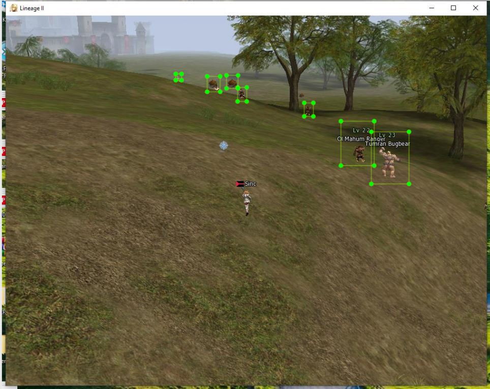

# Lineage 2 Bot - Machine learning solution

## The Goal for the project

The goal is as simple as possible. Detect monsters from the screenshot and get coordinates where they are located.

# How was data labelled and trained?

**Data was labeled for Yolo - meaning - each picture has its .txt file! As a result I got data.weights - this file can be used by Darknet.**

# All files available for download

- [Images + labels + trained data](https://drive.google.com/file/d/1xVmimBWY1zi09KIUrOcHX1AzyYJDgNwr/view?usp=sharing)

# What machine am I using?

| OS           | WSL2 Ubuntu on Windows 10                         |
| ------------ | ------------------------------------------------- |
| Processor    | Intel(R) Core(TM) i5-6200U CPU @ 2.30GHz 2.40 GHz |
| RAM          | 8 gigs                                            |
| Graphic Card | NVIDIA GeForce 940MX                              |

# How am I running the algorithm?

**I tried two approaches:**

## Javascript approach:

As a javascript developer I tried to use [nodejs darknet library](https://www.npmjs.com/package/darknet)

After you downloaded the git repository, you can hit two commands:

`npm install` - this command will install all dependencies
`node server` - this command will run the script

**What is really awesome is the fact that this approach returns coordinates. Unfortunately they seem to be corrupted and also - it takes a lot of time for each image evalution (about 15 seconds)**

## Natitve darknet approach

I tried [darknet library](https://pjreddie.com/darknet/yolo/) - everything is loaded successfuly with command:

`./darknet detect test.cfg data.weights 1.jpg`

Unfortunately it takes 15 seconds to analyze the image 1.jpg...

# So what is the issue?

It seems both approaches (Javascript and Darknet native) takes about 15 seconds to analyze the image. Also, it seems coordinates are wrong.

# Is my computer slow?

It does not seem to be the case since I was loading COCO-SSD on a pretrained model and got results in about 1 second...

# I request help please

I think data is trained correctly, what I need is actually load the data once and than do img analysis in about **500ms** or even less!

Is this even possible?
